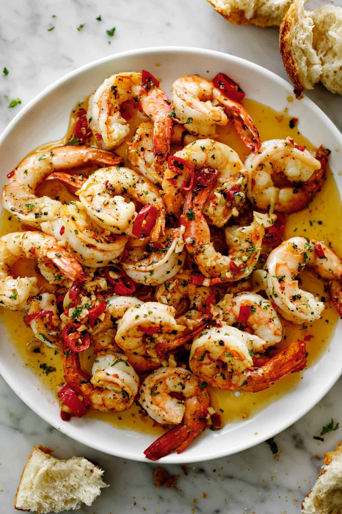

# **Restaurant Website - Reestar** 🍽️  

## **Aim**  
To design and develop a **responsive restaurant website** using **HTML & CSS** that showcases a restaurant’s menu and provides a contact form for customer inquiries.  

## **Procedure**  
1. **Create the project structure**  
   - `index.html`: Contains the restaurant’s homepage with the menu and contact form.  
   - `restar.css`: Styles the webpage to enhance its appearance.  
   - `food1.jpg`, `food2.jpg`, `food3.jpg`, `food4.jpg`: Sample images for the restaurant’s dishes.  

2. **Develop the webpage using HTML**  
   - Add a **navigation bar** with the restaurant name and menu links.  
   - Design **menu cards** showcasing different dishes with images, names, and an "Order Now" button.  
   - Implement a **contact form** for users to submit inquiries.  

3. **Style the website using CSS**  
   - Apply **flexbox** for a well-structured menu layout.  
   - Add **background colors, padding, and border styles** for an appealing design.  
   - Customize **buttons** to improve user interaction.  

---

## **Code Implementation**  

### **HTML (`index.html`)**
```html
<!DOCTYPE html>
<html>

<head>
    <meta charset="UTF-8">
    <link rel="stylesheet" href="restar.css">
    <meta name="viewport" content="width=device-width, initial-scale=1.0">
    <title>Reestar - Restaurant</title>
</head>

<body>
    <div class="container">
        <div class="topnav">
            <h2 class="topnav__title">Reestar</h2>
            <p class="topnav__desc">Home | Recipe | Contact</p>
        </div>

        <div class="container2">
            <div class="card1">
                
                <h4>Spicy Garlic Butter Shrimp</h4>
                <p>Delicious and spicy</p>
                <button type="submit" class="card1__button">Order Now</button>
            </div>

            <div class="card2">
                
                <h4>Creamy Alfredo Pasta</h4>
                <p>Delicious and creamy</p>
                <button type="submit" class="card2__button">Order Now</button>
            </div>

            <div class="card3">
                
                <h4>Grilled Lemon Herb Chicken</h4>
                <p>Perfectly grilled with herbs</p>
                <button type="submit" class="card3__button">Order Now</button>
            </div>

            <div class="card4">
                
                <h4>Classic Chocolate Pancakes</h4>
                <p>Sweet and delightful</p>
                <button type="submit" class="card4__button">Order Now</button>
            </div>
        </div>

        <div class="container3">
            <div class="submitform">
                <h3>Contact Us</h3>
                <table class="table">
                    <tr>
                        <td>Name:</td>
                        <td><input type="text"></td>
                    </tr>
                    <tr>
                        <td>Age:</td>
                        <td><input type="number"></td>
                    </tr>
                    <tr>
                        <td>Email:</td>
                        <td><input type="email"></td>
                    </tr>
                </table>
                <button type="submit" class="Sendbutton">Send</button>
            </div>
        </div>
    </div>
</body>

</html>
```

---

### **CSS (`restar.css`)**
```css
* {
    padding: 0;
    margin: 0;
}

.container {
    padding: 50px;
    text-align: center;
}

.topnav {
    background-color: black;
    color: white;
    padding: 30px;
}

.container2 {
    display: flex;
    text-align: center;
    gap: 20px;
    justify-content: center;
    margin-top: 10px;
}

.card1, .card2, .card3, .card4 {
    border: 1px solid black;
    padding: 10px;
    text-align: center;
    border-radius: 10px;
    width: 220px;
}

.card1__button, .card2__button, .card3__button, .card4__button {
    padding: 5px 10px;
    color: black;
    background-color: pink;
    border-radius: 10px;
    border: none;
    cursor: pointer;
}

.table {
    text-align: center;
    display: inline-block;
}

.container3 {
    background-color: black;
    color: white;
    padding: 10px;
    margin-top: 10px;
}

.Sendbutton {
    padding: 10px;
    color: black;
    background-color: palegreen;
    width: 300px;
    text-align: center;
    border: none;
    border-radius: 5px;
    margin-top: 10px;
    cursor: pointer;
}

h2 {
    font-size: 60px;
}
```

---

## **Output**  
- A **stylish restaurant website** displaying menu items with images, descriptions, and an "Order Now" button.  
- A **contact form** where users can enter their name, age, and email.  
- A **responsive and structured layout** using CSS.  

---

## **Conclusion**  
This project successfully implements a **simple and elegant restaurant website** using **HTML & CSS**. It showcases menu items with an interactive UI and provides a form for customer engagement. The design is **clean, responsive, and visually appealing**, making it a great addition to a portfolio.  

---

### 🔗 **GitHub Repository**  

